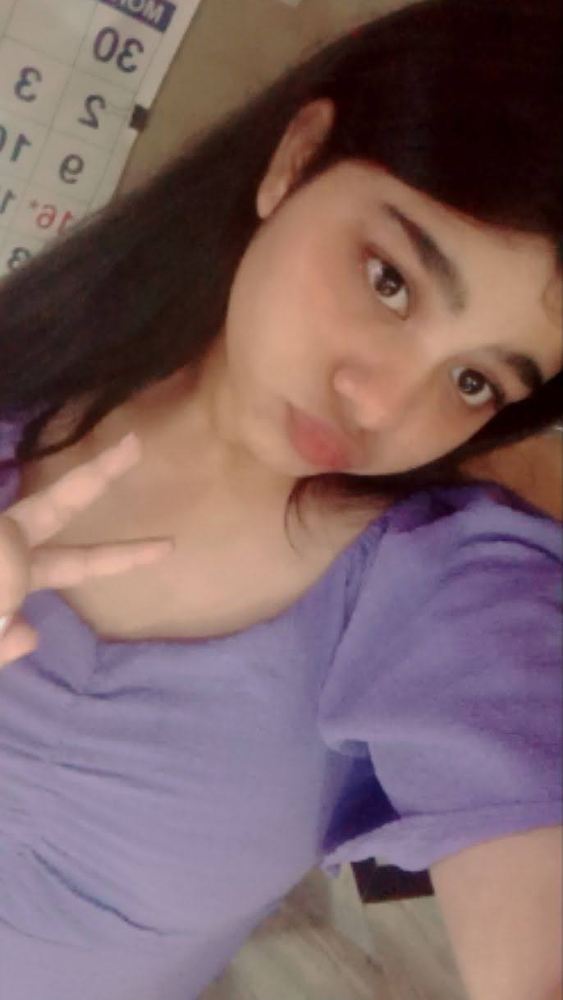

<!DOCTYPE html><html lang="en">
<head>
  <meta charset="UTF-8">
  <meta name="viewport" content="width=device-width, initial-scale=1.0">
  <title>THE LOST WEB</title>
  
</head>
<body>
  <nav>
    <a href="#home">Home</a>
    <a href="#about">About</a>
    <a href="#me">Me</a>
    <a href="#blogs">Blogs</a>
    <a href="#games">Games</a>
  </nav>
  <section id="home">
    <h2>Welcome 🌸</h2>
    
This is my cozy corner on the internet where I blog, game, and vibe. You're invited!

  </section>
  <section id="about">
    <h2>About</h2>
    
This website is where I pour my heart out — with blogs and games, all made by me!

  </section>
  <section id="me">
    <h2>About Me</h2>
    
    
Hi there! I'm Kamakshi and this is my first time creating a website where I blog and maybe live. I'm 18 and I'm very much interested in gaming and doing nothing but also a little bit of coding. I love making friends, and in person I maybe an extrovert but I'm not much confident if you ask me but that's ok. That's how life works right!?. I might not be perfect and neither is this website but I hope y'all like it 🙂. Thanks for being here. Toddles!

  </section>
  <section id="blogs">
    <h2>Blog 1 ♥️</h2>
    <pre>Its been a rough day and while blaming god for everything that's happening in my life I realised what the actual problem was 
      and so here I'm discussing about THE REAL PROBLEM......with this poem----->
      There's nothing more important to me than to be... to live...to feel
      but still the question echoes: is it truly necessary? Alone without love, no tender care to cradle my heart, seeking souls to halt this solitude,
      but shadows chase me still, like demons dancing in the dark of my restless mind.
      The world once sparkled bright in solitary glow,
      but now I'm encircled by strangers whose hearts are void, each glance a dagger, every word a wound, they bury my hope deeper than any weapon can wound.
      Innocence was my shroud, believing in binds of closeness, convincing myself it’s me, 
      that I’m the flaw, but no, no, no— I’m just a marionette, strings pulled for their delight, 
      yet I’ve grown; perhaps my heart remains a timid child, screaming silently, longing to cry,
      longing to be whole, and still I know, the mirror reflects the problem within me, cause yes! the problem is me.....

23/06/2025</pre>
    <h2>Blog 2 ♥️</h2>
    <pre>I've been realising lately that everything I do will never be enough or maybe...... I'M NOT ACTUALLY DOING ENOUGH------>

Crying in silence, running through pain, Screaming inside like a voice in the rain. I've given my all, done more than I could, Yet still I'm unseen, misunderstood.

For those that I love, I’ve carried the weight, Faced every storm, surrendered to fate. But they look at me with eyes so cold, And I’m lost in stories I've already told.

Lost in the past, in shadows I flee, Trapped in a place I never wished to be. I wonder aloud—what do I desire? When did my soul lose its fire?

I’ve become someone I never planned, A stranger shaped by unseen hands. Not cruel, not heartless, not a foe— Just tired, just broken, moving slow.

They say I’m wrong, they think I’m weak, But maybe I’m just too soft to speak. Maybe my love was never enough To heal the cracks, to smooth the rough.

I’ve searched within, I’ve tried my best, But some battles don’t end in rest. Now I stand with nothing left to prove, Just the ache of all I couldn’t move.

So if I seem like I’m drifting apart, Know it’s not hate—it’s a heavy heart. I gave my all, yet here I stand, Still wondering if I was ever enough... in anyone’s hands......

24/06/2025</pre>
  </section>
  <section id="games">
    <h2>Games 🎮</h2>
    

      

        <h3>Memory Game</h3>
        

        <button onclick="startMemoryGame()">Restart</button>
      

    

  </section>
  <audio id="flip-sound" src="https://cdn.pixabay.com/audio/2022/03/15/audio_aab9ac687e.mp3"></audio>
  
</body>
</html>
